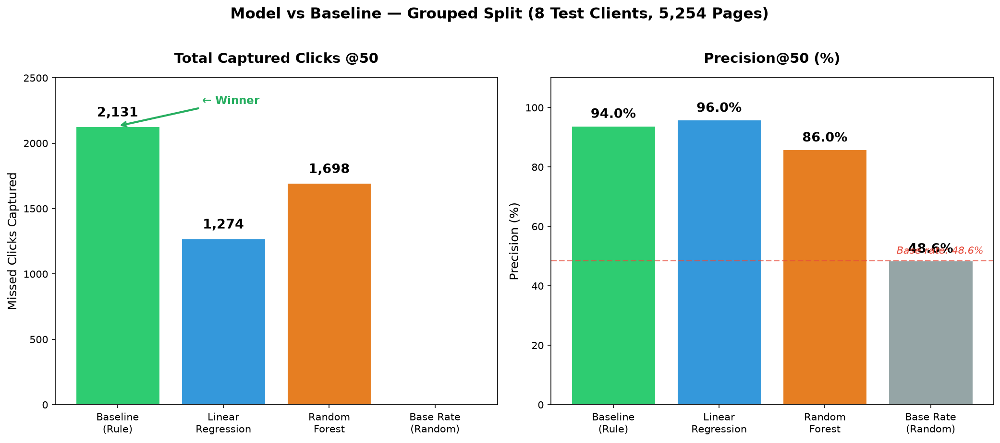
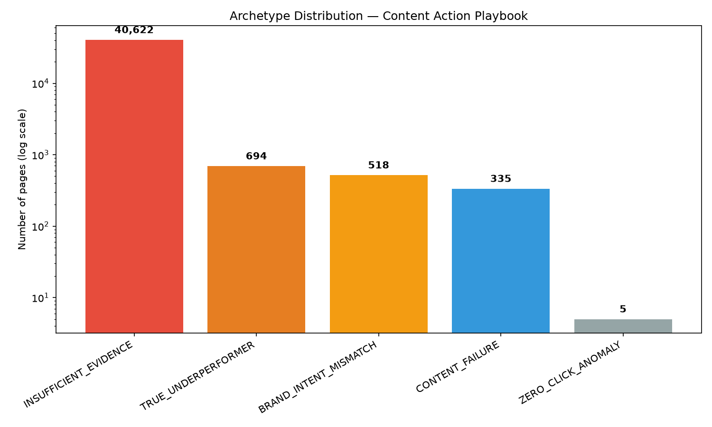
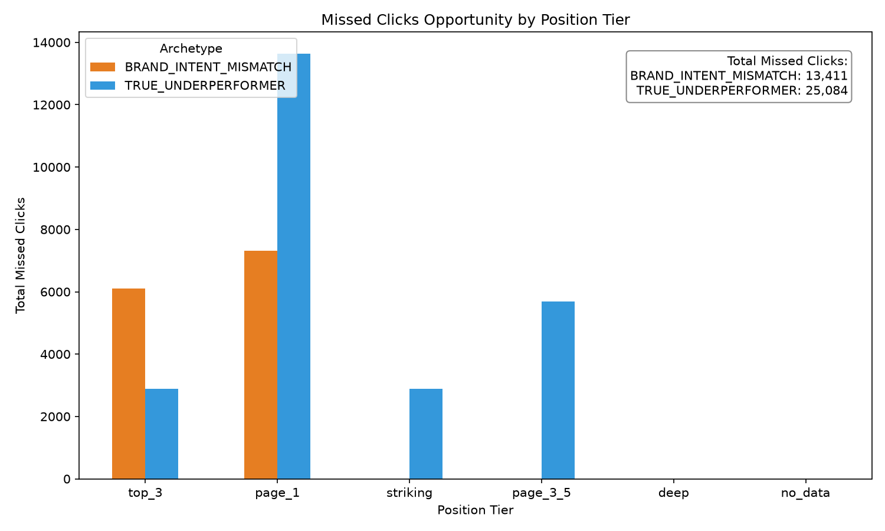
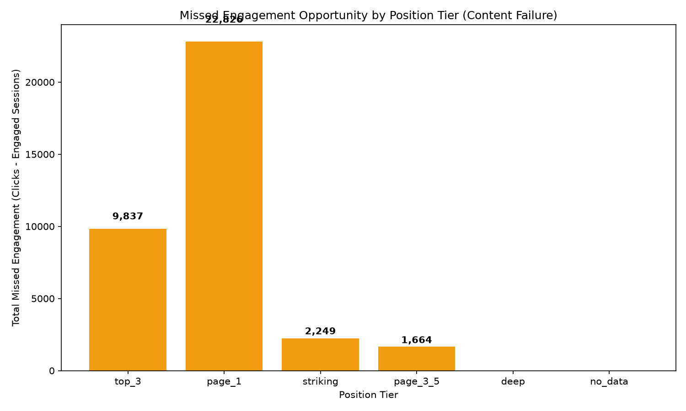

# CTR & Engagement Opportunity Scoring

**A Search Intelligence Study on Real Production Data**

**Author:** Samiya Shahzad Malik · **Date:** August 2026 · **Lane:** CTR / Engagement Opportunity Scoring

---

## Abstract

SEO teams manage thousands of pages but can only review a handful each week. This study asks: **which pages should be reviewed first because they appear to underperform in clicks or engagement relative to their search visibility?** Using 79 million rows of real production search data from the FlyRank Internship Warehouse, we built a ranked review queue that scores each page's opportunity gap — the difference between its actual click-through rate and what similar pages at the same search position typically achieve. We compared a hand-written baseline rule against Linear Regression and Random Forest models, evaluated on a grouped-by-client test set to prevent data leakage. The baseline outperformed both ML models on captured business value (2,131 clicks vs. 1,274 and 1,698), confirming that for this fundamentally algebraic problem, a simple heuristic is the right production system. The final output is a five-archetype action playbook that routes different failure patterns to different teams — not a single "fix everything" flag.

---

## 1. Introduction

SEO teams often manage thousands of pages but have time to review only a small number each week. Rather than trying to predict whether a page is simply "good" or "bad," this project builds a ranking system that prioritizes pages with the greatest opportunity for improvement.

**Research Question:** Which pages should an SEO team review first because they appear to underperform in clicks or engagement relative to their search visibility?

**Decision it supports:** Given limited time, which pages should the team review this week?

**How it works:** The system produces a ranked review queue — not a yes/no prediction. Each page gets an Opportunity Score together with a reason code that explains why it was flagged. A reviewer then looks at the top-ranked pages and decides whether to:

- Improve titles or meta descriptions
- Refresh content
- Review content quality
- Improve user engagement
- Monitor the page instead of changing it

The system supports human decisions — it does not replace them.

**Cost of getting it wrong:**

- *False positive* — the model ranks a page highly but it does not actually need review. Cost: the team wastes time investigating a page that was fine.
- *False negative* — a page with real opportunity never gets recommended. Cost: the business misses potential traffic or engagement gains because nobody looked at it.

**Why ML was explored:** The relationship between impressions, CTR, position, freshness, and engagement is too tangled for a single hand-written rule. A machine learning model can potentially learn useful combinations of these signals to prioritize pages more effectively. The goal was to test whether ML improves prioritization — not to automate SEO decisions.

---

## 2. Data

**Dataset:** FlyRank Internship Warehouse — a gated release on Hugging Face containing real production search performance data. Tables used: `fact_content_daily_performance` (daily search and engagement metrics from Google Search Console and Google Analytics 4) joined with `dim_content` (page metadata). All identifiers are pseudonymous (`content_hash_id`, `client_hash_id`) — no real URLs or client names appear anywhere in this study.

**Time window:** March 2026 data serves as features (the observable past). April 2026 data serves as the outcome window (what we evaluate against). This simulates a real decision point: on May 1st, an analyst has finalized March data and wants to know which pages underperformed in April.

### What we excluded and why

**Connectivity filter:** We restricted the dataset to clients with confirmed GSC and GA4 connectivity (`client_has_gsc IS TRUE` and `client_has_ga4 IS TRUE`), applied at the row level so that mid-month connection changes were handled correctly. This excluded approximately 22% of clients who lacked one or both integrations, since their activity is fundamentally unmeasurable rather than genuinely zero. A naive filter on daily activity (`ga4_data_available IS TRUE`) was rejected because it would discard real zero-visit page-days — and a page with search visibility but zero visitors is exactly the kind of signal this project is designed to surface.

**500-impression exclusion:** Pages with fewer than 500 monthly impressions were excluded from the eligible-page population used for opportunity scoring. This threshold is grounded in an observed finding: approximately 50% of pages in the dataset had exactly 0 impressions, and these zeros were distributed across many clients at broadly similar rates (roughly 44–53%), confirming this is the normal shape of the data rather than a pipeline artifact. Without this filter, CTR calculated on near-zero impression counts would be undefined (0/0) or wildly unstable from tiny sample sizes, making cross-page comparisons unreliable. The 500-impression cutoff is therefore not an arbitrary round number — it statistically removes this unstable tail and focuses the analysis on pages where CTR and engagement are actually measurable.

---

## 3. Methodology

### Target definition

The target is **April missed clicks** — a continuous score that doubles as the ranking metric. For each page, we compute:

> `missed_clicks = (tier_avg_ctr − page_ctr) × impressions`, clipped at zero.

Pages are grouped into position tiers (top 3, page 1, striking distance 10–20, pages 3–5, deep) and each page's CTR is compared against its own tier's average *in the same month*. This means a page is only penalized for underperforming relative to peers at a similar search position. The raw missed-clicks value is then log-transformed (`log1p`) to stabilize the heavy-tailed distribution before modeling.

### Features

Five March-only signals, all knowable at the April 1st decision moment:

| Feature | Why it is safe |
|---|---|
| `log_impressions_march` | Finalized March metric — no future data |
| `log_clicks_march` | Finalized March metric |
| `log_engaged_sessions_march` | Finalized March metric |
| `ctr_march` | Derived from March clicks ÷ March impressions |
| `average_position_march` | Finalized March metric |

All five use log-transforms on the three heavy-tailed volume columns. No target-derived or future-window features are included.

### Baseline

The baseline is a hand-written rule from Week 4: rank pages by their March `missed_clicks` (same formula as above, applied to March data). This is the system the ML models must beat.

### Split design

The split is both **time-aware** and **grouped by client**:

- **Time-aware:** March data (features) predicts April outcomes (target). No time-travel leakage is possible.
- **Grouped by client:** Train/test is split at the `client_hash_id` level using `GroupShuffleSplit`. A single dominant client accounts for roughly 31,887 pages; a random row-level split would bleed this client into both sets, letting the model memorize site-specific structure instead of learning generalizable patterns.
- **Result:** 22 clients (31,750 pages) in training; 8 clients (5,254 pages) in testing. No client appears in both sets.

### Leakage checks

Three categories of leakage were audited:

1. **Target-derived features:** The target uses April impressions and clicks. Our features use March data only — physically impossible for April outcomes to back-propagate into March metrics.
2. **Future information:** The newest date in any feature is March 31. All information is finalized before the April 1 decision point.
3. **System-derived features:** `missed_clicks_march` (the baseline's own score) was deliberately excluded, forcing the model to learn from raw signals rather than piggybacking on a pre-built heuristic.

**Poison test (proof of instrument):** A deliberately leaked feature (`missed_clicks_april × 0.9`) was injected. Precision@50 barely moved (96% → 98%) due to a ceiling effect, but total captured clicks jumped from 1,274 to 2,651 — a 108% increase closely tracking the 0.9 scaling factor. This confirms the evaluation pipeline detects leakage, and that captured clicks (not Precision@50) is the more sensitive instrument.

---

## 4. Results

All models were evaluated on the same grouped test set (8 clients, 5,254 pages) against the same April ground truth. Two metrics are reported side by side:

- **Precision@50:** What fraction of the top 50 recommended pages actually met the opportunity condition in April (actual CTR < 50% of tier average).
- **Total Captured Clicks @50:** The sum of actual April missed clicks in the top 50 — the real business value.

### The honest scoreboard

| Model | Precision@50 | Captured Clicks @50 |
|---|---|---|
| **Baseline (hand-written rule)** | 94.0% | **2,131** |
| Linear Regression | **96.0%** | 1,274 |
| Random Forest | 86.0% | 1,698 |
| *Base rate (random guessing)* | *48.6%* | *—* |

### What the random-vs-grouped comparison revealed

| Split method | Precision@50 | Captured Clicks |
|---|---|---|
| Random (cheating) | 98.0% | 3,132 |
| Grouped (honest) | 96.0% | 1,274 |

The precision difference looks small (2 percentage points), but the captured-clicks gap is massive — the random split was hallucinating business value by memorizing client-specific patterns.

### Interpretation

**The baseline wins on business value.** The hand-written rule captured 2,131 clicks vs. 1,274 for Linear Regression and 1,698 for Random Forest. Because the problem is fundamentally algebraic (CTR gap × volume), the baseline heuristic naturally surfaces the biggest "whale" pages.

**Linear Regression achieves the highest precision but lowest value.** The `log1p` transformation stabilized training but made the model less aggressive — it prioritized safe, medium-sized opportunities instead of hunting the massive traffic whales.

**Random Forest partially closes the value gap** (1,698 clicks) but at the cost of lower precision (86%). This highlights a real precision-vs-value trade-off.

**Volume dominance confirmed.** A sensitivity check removed `log_impressions_march` and `log_clicks_march` from the Linear Regression model. Captured value collapsed by 86% (1,274 → 179 clicks). The model's signal is almost entirely volume-driven — it has not found independent SEO insight beyond "big pages stay big."

**78% of the top 50 came from a single client.** This is expected behavior (the model correctly prioritized the largest client), but it means the 96% precision figure is heavily weighted on one client's data.

### Verdict

We observed that the ML models did not beat the baseline on measured business value. The baseline heuristic remains the recommended decision-support system — it is interpretable and requires no ML infrastructure. The upward trend from Linear Regression to Random Forest provides only a directional signal that more flexible models might be worth investigating. Future work must validate across multiple client splits to confirm this trend.

---

## 5. Limitations & Honest Framing

| Limitation | Why it matters |
|---|---|
| **~22% of clients are invisible** | Clients without both GA4 and GSC connected never enter the data. We cannot flag what we cannot see. |
| **Pages under 500 impressions excluded** | CTR from tiny denominators is noise. Long-tail pages might include genuinely broken ones, but we have no statistical basis to diagnose them. |
| **~75% of eligible pages land in Insufficient Evidence** | By requiring ≥10 clicks for Archetype 4 and ≥50 for Archetype 3, we chose trustworthy flags over comprehensive coverage. That is a deliberate trade-off. |
| **Single-month snapshot (March 2026)** | Seasonal patterns or algorithm updates could shift which pages look like underperformers. A page that underperformed in March might be fine in April. |
| **Single grouped split (8 test clients)** | 78% of top-50 predictions came from one client. Full GroupKFold cross-validation is needed to prove generalizability. |
| **Volume dominance** | Removing volume features collapsed captured value by 86%. The model relies almost entirely on raw traffic size, not independent SEO insight. |
| **Cross-sectional, not causal** | We observed "pages with this pattern tend to have low CTR" — we did not prove "this pattern causes low CTR." |

**Claim language used throughout this paper:** observed, measured, directional, decision-support. No causal claims are made. No claims about decoding Google's algorithm.

---

## 6. Ranked Recommendations

Because the baseline rule outperformed the ML models on business value, the final action playbook is built on a **rule-based archetype system** — not the ML model. The ML experiment validated that this simpler approach is the right one for this problem.

### The five archetypes

Every page is evaluated top-down through this list. A page can only belong to one archetype — the first rule that fires claims it.

| # | Archetype | Rule | Action | Team |
|---|---|---|---|---|
| 1 | **Zero-click anomaly** | clicks = 0 AND impressions ≥ 30,000 | Check SERP for zero-click query type. If Google answers directly, the page is unwinnable. | SEO analyst |
| 2 | **Brand / intent mismatch** | position ≤ 5 AND impressions ≥ 3,000 AND CTR < 25% of tier avg | Check GSC queries. If traffic is branded, exclude from queue entirely. | SEO analyst |
| 3 | **Content failure** | clicks ≥ 50 AND engagement rate < 1% | Do NOT touch the title — it is working. Audit content and UX instead. | Content / dev team |
| 4 | **True underperformer** | clicks ≥ 10 AND CTR < 50% of tier avg | Rewrite title tag and meta description. | SEO copywriter |
| 5 | **Insufficient evidence** | None of the above fired | No action. Revisit next month with more data. | — |

### Distribution (March 2026, n = 42,174 eligible pages)

| Archetype | Count |
|---|---|
| Insufficient evidence | 40,622 |
| True underperformer | 694 |
| Brand / intent mismatch | 518 |
| Content failure | 335 |
| Zero-click anomaly | 5 |

### Why the precedence order matters

The order is based on cost-of-error reasoning: at each step, we default to the archetype whose mistake is cheaper and more recoverable. Skipping a page costs nothing; sending a writer to fix a title on a page with broken content wastes real hours and does not solve the problem.

- **Archetypes 1–2** route to an SEO analyst (investigate before acting)
- **Archetype 3** routes to content/dev (fix the page, not the snippet)
- **Archetype 4** routes to a copywriter (fix the snippet)

This is not relabeling the same fix four times — it is routing different problems to different teams.

### The no-go list

1. **No flag should auto-trigger a rewrite.** Every flag is a recommendation to investigate, not an order.
2. **Archetype 1 pages get no content or metadata changes.** The problem is on the SERP, not on the site.
3. **Archetype 3 pages never go to a copywriter.** The title is working — sending it to a copywriter risks breaking the one thing that is not broken.
4. **Archetype 5 pages get zero action.** The whole point is refusing to act on noise.

### Monitoring

The `tier_avg_ctr` values baked into the archetype rules are a snapshot of March 2026. Each month, re-run the tier average calculation on fresh data and compare to the current thresholds. If any archetype count doubles or halves while the client base is roughly unchanged, the tier averages have likely drifted and need updating before trusting the queue.

This is a manual monthly sanity check, not an automated retraining pipeline — consistent with the philosophy that this system is decision-support, not automation.

---

## 7. Reproducibility

All code lives in this repository. To reproduce the full analysis:

| Notebook | What it does |
|---|---|
| [`w01_research_question.ipynb`](work/notebooks/w01_research_question.ipynb) | Research question and lane choice |
| [`w02_ml_task_framing.ipynb`](work/notebooks/w02_ml_task_framing.ipynb) | ML task type, target proxy, success metric |
| [`w03_data_contract.ipynb`](work/notebooks/w03_data_contract.ipynb) | Data contract, verification queries, feature leakage check |
| [`w04_baseline_score.ipynb`](work/notebooks/w04_baseline_score.ipynb) | Signal checks, baseline rule, top-20 review |
| [`w05_model.ipynb`](work/notebooks/w05_model.ipynb) | Linear Regression & Random Forest, grouped split, sensitivity check |
| [`w06_validation_audit.ipynb`](work/notebooks/w06_validation_audit.ipynb) | Research paper audit, honest split comparison, poison test, claim rewrite |
| [`w07_action_playbook.ipynb`](work/notebooks/w07_action_playbook.ipynb) | Five archetypes, ranked queue, monitoring triggers |
| [`capstone.ipynb`](work/notebooks/capstone.ipynb) | Full capstone summary (mirrors this paper) |

**Requirements:** Python 3.14+, packages in `requirements.txt` (pandas, scikit-learn, duckdb, python-dotenv).

**Data access:** Request access to the [FlyRank Internship Warehouse on Hugging Face](https://huggingface.co/datasets/FlyRank/internship-warehouse) (instant approval). Store your Hugging Face READ token as `HF_TOKEN` — never paste tokens into cells.

**Random seed:** `random_state=42` used in all splits and models.

---

## 8. Acknowledgments & Data Credit

Built on the [FlyRank ML Internship dataset](https://flyrank.ai). This study uses real production search data provided through FlyRank's ML internship program. All data was accessed through the gated Hugging Face release with pseudonymous identifiers — no private client information appears in this work.

---

*All claims in this paper use careful language: observed, measured, directional, decision-support. No causal claims are made. No claims about predicting or decoding Google's ranking algorithm.*
